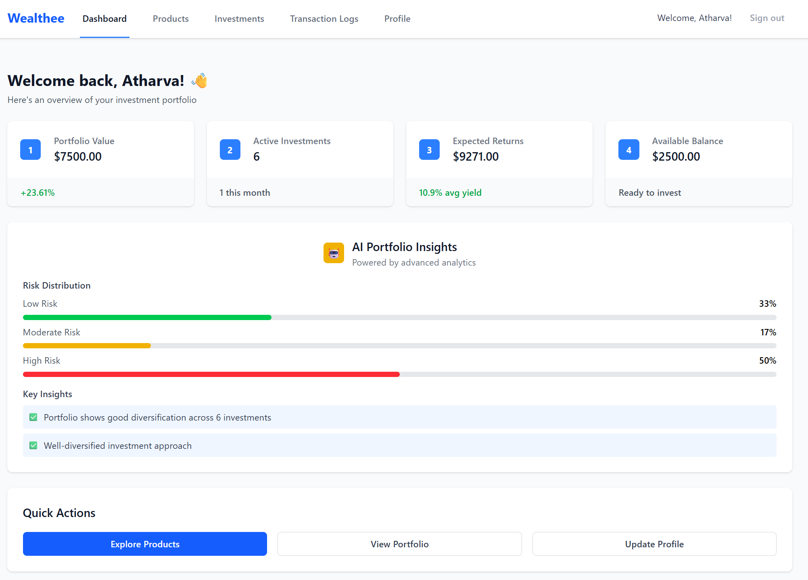
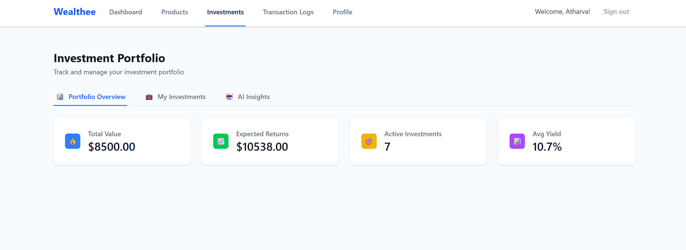
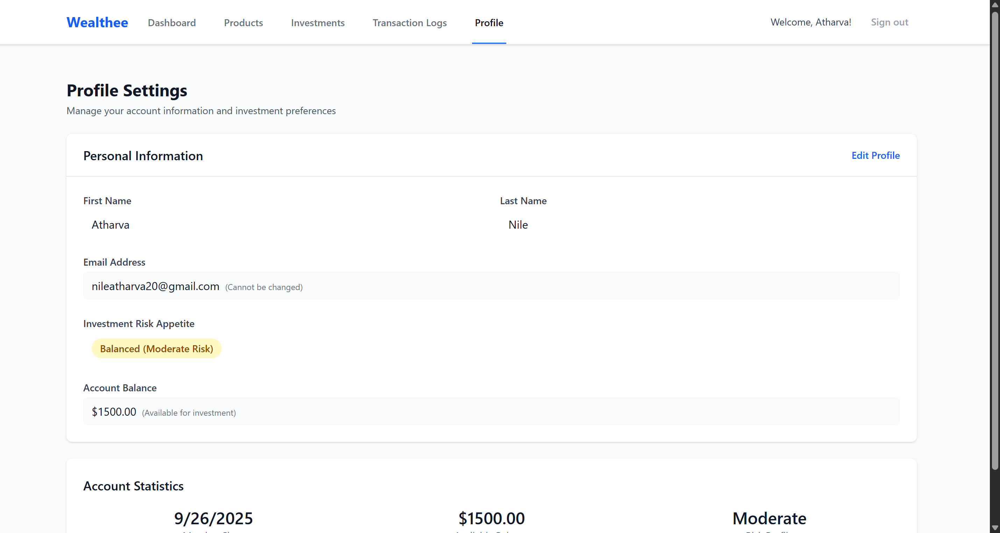
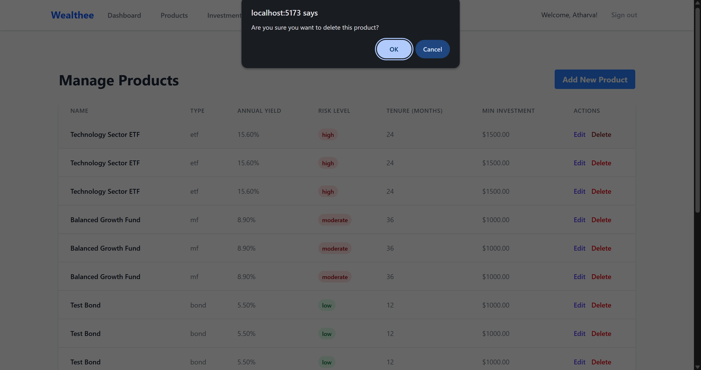

# 📈 GripInvest Mini Investment Platform

An AI-powered full-stack investment platform with user authentication, dynamic product recommendations, portfolio insights, transaction logging, and secure investment management.

**Tagline:** _"Invest smarter with AI-driven insights."_

---

## Watch Demo video :- 

[Watch the video](https://drive.google.com/file/d/1pwjcZbnt9LUFZHhYAgnXlLwYSfPuPMSS/view?usp=sharing)

---

## 🌟 Features

- 🔐 **JWT-based Auth**: Secure login and signup with token authentication
- 📊 **Product Management**: Browse, add, and edit investment products
- 💼 **Investment Tracking**: Create and view investments linked to products
- 🤖 **AI Insights**: Personalized product recommendations and portfolio analysis powered by AI
- 📋 **Transaction Logs**: Detailed API transaction logging for audit and analysis
- 🌐 **Modern UI**: React + Tailwind CSS front end with smooth user experience
- 🐳 **Containerized**: Docker setup for backend, frontend, and MySQL service
- 📦 **API Documentation**: Easy-to-use RESTful endpoints with JSON responses

---

## 🤖 AI Usage in GripInvest

GripInvest leverages advanced AI capabilities to enhance the investment experience by providing intelligent insights and personalized recommendations:

- **Password Strength Analysis:** During user signup, AI analyzes password strength using the Hugging Face API to promote better security with real-time feedback.
- **Personalized Product Recommendations:** AI models recommend investment products tailored to each user’s risk appetite, age, and financial goals, enabling smarter investment decisions.
- **Portfolio Insights and Risk Analysis:** Users receive AI-generated insights into their portfolio diversification, risk distribution, and expected returns for improved portfolio management.
- **Error Log Summarization:** AI analyzes recent transaction error logs to identify patterns and provide actionable recommendations for system reliability improvements.

These AI-driven features utilize external AI services via APIs to deliver a more dynamic, user-centric platform.

---

## 📁 Tech Stack

- **Frontend:** React, Tailwind CSS, React Router, React Query, React Hook Form, Vite
- **Backend:** Node.js, Express.js, MySQL (mysql2/promise), JWT
- **AI Services:** Hugging Face API integration
- **Email:** Nodemailer SMTP Integration for password resets
- **DevOps:** Docker, Docker Compose, Health Checks, Logging

---

## 🔧 Getting Started

### 1. Clone the repo (frontend and backend)

```bash
git clone https://github.com/atharva5924/gripinvest_winter_internship_backend.git
```

---

### 2. Backend Setup

In backend directory:

```bash
cd server
```

- Create `.env` file with:

```env
PORT=5000
DB_HOST=mysql
DB_USER=root
DB_PASSWORD=Atha@7138
DB_NAME=gripinvest_db
JWT_SECRET=mySuperSecretKey
EMAIL_HOST=smtp.gmail.com
EMAIL_PORT=587
EMAIL_USER=your-email@gmail.com
EMAIL_PASS=your-email-password
HUGGINGFACE_API_KEY=your_huggingface_key
HF_TOKEN=your_huggingface_token
CLIENT_ORIGIN=http://localhost:5173
```

```bash
- Install dependencies and run:
npm install
npm run dev # or npm start if configured
```

---

### 3. Frontend Setup

In frontend directory:

- Create `.env` file with:

```env
VITE_API_BASE_URL=http://localhost:5000/api
```

```bash
- Install dependencies and run dev server:
npm install
npm run dev
```

Frontend runs at `http://localhost:5173/`

---

### 4. Run with Docker Compose (Recommended)

Project root (containing `docker-compose.yml`):

```bash
docker-compose up --build
```

Services started:

- MySQL - port 3306
- Backend API - port 5000
- Frontend (Vite + Nginx) - port 5173

To stop:

```bash
docker-compose down
```

---

### 5. Database Seeding

Seed script runs automatically on backend DB initialization if no users found.

To seed manually (inside backend container):

```bash
docker-compose exec backend sh
node seeds/seed.js # or run your specific seed command
```

---

## 📄 Database Schema

This project uses predefined SQL schemas for all tables to ensure data consistency and integrity.

- The database schema includes tables for `users`, `investment_products`, `investments`, and `transaction_logs`.
- The full SQL schema definitions are part of the backend initialization script located in `config/database.js` which creates tables if they do not exist.
- Key schema features:
  - User management with role-based access (`users` table)
  - Detailed investment product catalog (`investment_products` table)
  - User investments with transaction history (`investments` table)
  - Comprehensive API transaction logging (`transaction_logs` table)

For complete clarity, see the schema code in [`config/database.js`](./backend/config/database.js).

---

## 📦 API Endpoints

### Authentication

| Method | Endpoint                   | Description                  |
| ------ | -------------------------- | ---------------------------- |
| POST   | `/api/auth/register`       | Register new user            |
| POST   | `/api/auth/login`          | Login user                    |
| GET    | `/api/auth/profile`        | Get user profile (Auth)       |
| POST   | `/api/auth/request-password-reset` | Request a password reset link |
| POST   | `/api/auth/reset-password` | Reset password using token    |


### Products

| Method | Endpoint                           | Description                                   |
| ------ | ---------------------------------- | --------------------------------------------- |
| GET    | `/api/products`                    | List products (filter & pagination)           |
| GET    | `/api/products/:id`                | Get product by ID                             |
| POST   | `/api/products`                    | Create new product (Admin only)               |
| GET    | `/api/products/recommendations`    | Get personalized product recommendations (Auth) |
| PUT    | `/api/products/:id`                | Update existing product (Admin only)          |
| DELETE | `/api/products/:id`                | Delete product (Admin only)                   |
| POST   | `/api/products/ai-generate-description` | Generate AI-based product description (Admin only) |

### Investments

| Method | Endpoint                       | Description               |
| ------ | ------------------------------ | ------------------------- |
| POST   | `/api/investments`             | Create investment         |
| GET    | `/api/investments`             | List user investments     |
| GET    | `/api/investments/portfolio`   | Get portfolio summary     |
| GET    | `/api/investments/portfolio/insights` | Get detailed portfolio insights |

### Transaction Logs

| Method | Endpoint                              | Description                    |
| ------ | ------------------------------------- | ------------------------------ |
| GET    | `/api/transaction-logs`               | Get user transaction logs      |
| GET    | `/api/transaction-logs/error-summary` | Get AI-generated error summary |

---

## 🐳 Docker & DevOps

### Dockerfiles included for backend and frontend

- Backend exposes `/health` endpoint for status check
- Logs are viewable using `docker logs <container>`

### Sample docker-compose.yml snippet

---

## 🧪 Testing

- Backend: Jest with 75%+ coverage on API/controller modules
- Frontend: Jest + React Testing Library for critical pages/components

Run backend tests:

```bash
cd .\server\
npm test
```

Run frontend tests:

```bash
cd .\client\
npm test
```

---

## 🧩 Screenshots

*Note: The data shown in the screenshots below is pre-inserted for demonstrating features and ensuring a clear visual representation.*

### 🏠 Landing Page

Welcome page introducing GripInvest.  


---

### 🧑‍💼 Login Page

User login interface for authenticated access.  


---

### 📝 Signup Page

User registration screen with password feedback.  


---

### 🔑 Forgot Password

Request password reset via email.  


---

### 🔒 Reset Password

Set a new password using email link token.  


---

### 📊 Dashboard

Your personalized investment portfolio overview.  



---

### 📦 Products

Browse available investment products with filtering.  


---

### 💼 Investments

Track and manage your investments.  

Portfolio Overview



My Investments


AI Insights


---

### 📋 Transaction Logs

View detailed logs of API activity and errors.


---

### 👤 Profile

Manage your user profile and risk preferences.  



---

### 🛠️ Admin Products

Admin panel to create/update/delete products.  


Create Products


Edit Products


Delete Products



---

## 👨‍💻 Developer

**Atharva Nile**
CSE Undergrad @ IIIT Nagpur
📧 nileatharva20@gmail.com
🔗 [LinkedIn](https://www.linkedin.com/in/atharva-nile-a50120294) • [GitHub](https://github.com/atharva5924)

---

## License

[MIT](LICENSE)

---

## Notes

- Always ensure your backend is running and accessible at the API_BASE_URL configured.
- Authentication tokens are stored securely in localStorage.
- Admin role controls access to product management features.
- Use Postman or similar tools to test API endpoints; include JWT tokens in the header.

---

Let me know if you want:

- A Hindi/Marathi short version.
- Custom badges or GIF recording.

I'll tailor the README further based on your preferences or interviewer expectations.

Feel free to reach out if you need setup help or additional instructions!

---
