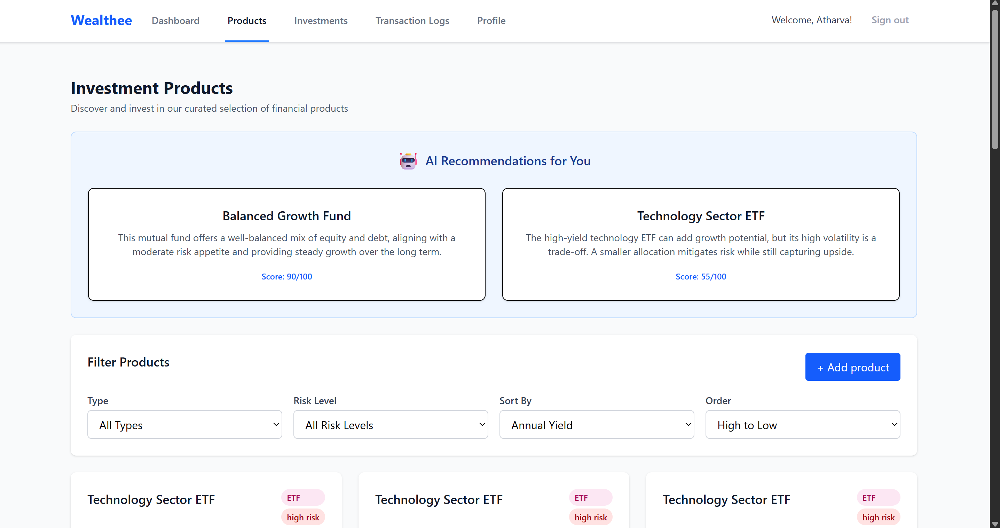

# 📈 GripInvest Mini Investment Platform

An AI-powered full-stack investment platform with user authentication, dynamic product recommendations, portfolio insights, transaction logging, and secure investment management.

**Tagline:** _"Invest smarter with AI-driven insights."_

---

## 🚀 Live Demo

_(Add your deployed URLs here if any)_

---

## 🌟 Features

- 🔐 **JWT-based Auth**: Secure login and signup with token authentication
- 📊 **Product Management**: Browse, add, and edit investment products
- 💼 **Investment Tracking**: Create and view investments linked to products
- 🤖 **AI Insights**: Personalized product recommendations and portfolio analysis powered by AI
- 📋 **Transaction Logs**: Detailed API transaction logging for audit and analysis
- 🌐 **Modern UI**: React + Tailwind CSS front end with smooth user experience
- 🐳 **Containerized**: Docker setup for backend, frontend, and MySQL service
- 📦 **API Documentation**: Easy-to-use RESTful endpoints with JSON responses

---

## 📁 Tech Stack

- **Frontend:** React, Tailwind CSS, React Router, React Query, React Hook Form, Vite
- **Backend:** Node.js, Express.js, MySQL (mysql2/promise), JWT
- **AI Services:** Hugging Face API integration
- **Email:** Nodemailer SMTP Integration for password resets
- **DevOps:** Docker, Docker Compose, Health Checks, Logging

---

## 🔧 Getting Started

### 1. Clone the repo (frontend and backend)

```bash
git clone https://github.com/atharva5924/InventoryPilot-frontend.git
```

---

### 2. Backend Setup

In backend directory:

```bash
cd server
```

- Create `.env` file with:

```env
PORT=5000
DB_HOST=mysql
DB_USER=root
DB_PASSWORD=Atha@7138
DB_NAME=gripinvest_db
JWT_SECRET=mySuperSecretKey
EMAIL_HOST=smtp.gmail.com
EMAIL_PORT=587
EMAIL_USER=your-email@gmail.com
EMAIL_PASS=your-email-password
HUGGINGFACE_API_KEY=your_huggingface_key
HF_TOKEN=your_huggingface_token
CLIENT_ORIGIN=http://localhost:5173
```

```bash
- Install dependencies and run:
npm install
npm run dev # or npm start if configured
```

---

### 3. Frontend Setup

In frontend directory:

- Create `.env` file with:

```env
VITE_API_BASE_URL=http://localhost:5000/api
```

```bash
- Install dependencies and run dev server:
npm install
npm run dev
```

Frontend runs at `http://localhost:5173/`

---

### 4. Run with Docker Compose (Recommended)

Project root (containing `docker-compose.yml`):

```bash
docker-compose up --build
```

Services started:

- MySQL - port 3306
- Backend API - port 5000
- Frontend (Vite + Nginx) - port 5173

To stop:

```bash
docker-compose down
```

---

### 5. Database Seeding

Seed script runs automatically on backend DB initialization if no users found.

To seed manually (inside backend container):

```bash
docker-compose exec backend sh
node seeds/seed.js # or run your specific seed command
```

---

## 📦 API Endpoints

### Authentication

| Method | Endpoint             | Description             |
| ------ | -------------------- | ----------------------- |
| POST   | `/api/auth/register` | Register new user       |
| POST   | `/api/auth/login`    | Login user              |
| GET    | `/api/auth/profile`  | Get user profile (Auth) |

### Products

| Method | Endpoint            | Description                         |
| ------ | ------------------- | ----------------------------------- |
| GET    | `/api/products`     | List products (filter & pagination) |
| GET    | `/api/products/:id` | Get product by ID                   |
| POST   | `/api/products`     | Create new product (Admin only)     |

### Investments

| Method | Endpoint                     | Description           |
| ------ | ---------------------------- | --------------------- |
| POST   | `/api/investments`           | Create investment     |
| GET    | `/api/investments`           | List user investments |
| GET    | `/api/investments/portfolio` | Get portfolio summary |

### Transaction Logs

| Method | Endpoint                              | Description                    |
| ------ | ------------------------------------- | ------------------------------ |
| GET    | `/api/transaction-logs`               | Get user transaction logs      |
| GET    | `/api/transaction-logs/error-summary` | Get AI-generated error summary |

---

## 🐳 Docker & DevOps

### Dockerfiles included for backend and frontend

- Backend exposes `/health` endpoint for status check
- Logs are viewable using `docker logs <container>`

### Sample docker-compose.yml snippet

---

## 🧪 Testing

- Backend: Jest with 75%+ coverage on API/controller modules
- Frontend: Jest + React Testing Library for critical pages/components

Run backend tests:

```bash
cd .\server\
npm test
```

Run frontend tests:

```bash
cd .\client\
npm test
```

---

## 🧩 Screenshots

### 🏠 Landing Page

Welcome page introducing GripInvest.  


---

### 🧑‍💼 Login Page

User login interface for authenticated access.  


---

### 📝 Signup Page

User registration screen with password feedback.  


---

### 🔑 Forgot Password

Request password reset via email.  


---

### 🔒 Reset Password
Set a new password using email link token.  


---

### 📊 Dashboard

Your personalized investment portfolio overview.  


---

### 📦 Products

Browse available investment products with filtering.  




---

### 💼 Investments

Track and manage your investments.  


---

### 📋 Transaction Logs
View detailed logs of API activity and errors.  


---

### 👤 Profile
Manage your user profile and risk preferences.  


---

### 🛠️ Admin Products
Admin panel to create/update products.  


---

## 👨‍💻 Developer

**Atharva Nile**
CSE Undergrad @ IIIT Nagpur
📧 nileatharva20@gmail.com
🔗 [LinkedIn](https://www.linkedin.com/in/atharva-nile-a50120294) • [GitHub](https://github.com/atharva5924)

---

## License

[MIT](LICENSE)

---

## Notes

- Always ensure your backend is running and accessible at the API_BASE_URL configured.
- Authentication tokens are stored securely in localStorage.
- Admin role controls access to product management features.
- Use Postman or similar tools to test API endpoints; include JWT tokens in the header.

---

Let me know if you want:

- A Hindi/Marathi short version.
- Custom badges or GIF recording.

I'll tailor the README further based on your preferences or interviewer expectations.

Feel free to reach out if you need setup help or additional instructions!

---
